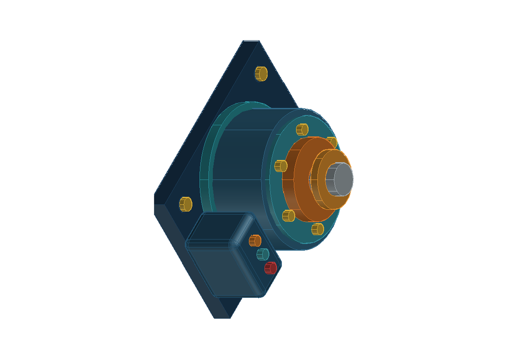

# AutoCAD-MCP

**面向 AI Agent 的可靠 AutoCAD 自动化：可核验几何、原生 3D 与可追溯交付。**

[](https://github.com/beiming183-cloud/AutoCAD-MCP/actions/workflows/tests.yml)
[](https://github.com/beiming183-cloud/AutoCAD-MCP/releases)
[](https://www.python.org/)
[](LICENSE)

[English](README.md) | [简体中文](README.zh-CN.md)



AutoCAD-MCP 可以把 Codex、Claude Code、Claude Desktop、Cursor 及其他标准 MCP 客户端连接到完整版 AutoCAD、AutoCAD LT 或无界面的 DXF 后端。它的重点不是“脚本没有报错”，而是让 Agent 能证明自己画了什么、保存了什么、交付文件是否与源图一致。

## 为什么选择它

- **写入可核验：** 严格参数、句柄回读、请求值与实际值差异、文档身份和版本检查，以及失败后的原子回滚。
- **覆盖实际 CAD 工作：** 结构化二维绘图、图层、尺寸、拓扑 DRC、AutoCAD 原生实体和布尔运算、受控产品特征、运动初筛和固定相机视图。
- **交付有证据：** 输出 DWG、DXF、PDF、PNG，重新审计导出 DXF，并记录纸张、比例、几何摘要、清单和 SHA-256。
- **不打扰桌面：** AutoCAD 默认在任务栏可见但保持最小化，绘图不抢焦点，也不会突然弹出 PDF 或图片查看器。
- **不绑定单一 Agent：** 使用标准 MCP stdio，同一套服务可供多种 MCP 客户端调用。
- **如实声明边界：** 对稳定边选择、抽壳、精确连续运动和材质离屏渲染等未完成能力明确返回不支持，不用近似结果冒充生产证据。

## 60 秒体验，无需 AutoCAD

下面的 Demo 会创建一张机械 DXF、执行语义 DRC、渲染 PNG，并输出验证结果：

```powershell
git clone https://github.com/beiming183-cloud/AutoCAD-MCP.git
cd AutoCAD-MCP
uv sync
uv run python examples/headless_demo.py
```

正常结果包含 `ok: true`、6 个实体和 `drc_status: PASS`。默认文件位于 `demo-output/`，也可通过 `AUTOCAD_MCP_OUTPUT_ROOT` 指定统一输出目录，例如 `D:/CAD-Automation`。

## AutoCAD 原生 3D 宣传图

在 AutoCAD 已由用户正常打开、MCP preflight 通过后，可以重现这张可编辑的旋转执行器宣传图：

```powershell
uv run python examples/generate_actuator_promo.py --record --pause 0.8
```

命令会在 AutoCAD 中逐步显示建模过程，生成固定等轴测 PNG，并保留最终文档。它是概念级 3D 能力展示，不等价于制造授权模型。
如果你先删除当前图形并希望绘制完成后全方位旋转展示，可以追加：`--reuse-active --rotate --rotation-seconds 12`。

## 后端选择

| 后端 | 运行环境 | 是否需要 AutoCAD | 适用场景 |
|------|----------|------------------|----------|
| **File IPC** | Windows Python | 是，完整版 AutoCAD 或 AutoCAD LT 2024+ | DWG、原生 3D、PDF、直接 PNG、完整审计与交付 |
| **ezdxf** | Windows/Linux/macOS/WSL | 否 | 无界面二维 DXF 生成、审计和确定性 PNG |

服务通过标准 MCP stdio 暴露 11 个整合工具：`drawing`、`entity`、`solid`、`product`、`layer`、`block`、`annotation`、`pid`、`transaction`、`view` 和 `system`。

遇到 AutoCAD 进程残留、Python COM 环境损坏或 Activity Insights 权限错误时，先调用只读的 `system(operation="preflight")`，再调用 `system(operation="ensure_ready")`。完整处理步骤见 [Windows AutoCAD 恢复指南](docs/WINDOWS-AUTOCAD-RECOVERY.md)。

## 完整版 AutoCAD 快速安装

### 1. 安装依赖

```powershell
git clone https://github.com/beiming183-cloud/AutoCAD-MCP.git
cd AutoCAD-MCP
uv sync
```

### 2. 加载调度器

在 AutoCAD 或 AutoCAD LT 中执行 `APPLOAD`，加载：

```text
lisp-code/mcp_dispatch.lsp
```

建议在 `APPLOAD` 对话框中加入启动组。加载成功后，命令行会显示调度器版本和就绪信息。

### 3. 配置任意 MCP 客户端

将下面配置加入客户端的 MCP 配置文件，并替换仓库路径：

```json
{
  "mcpServers": {
    "autocad-mcp": {
      "type": "stdio",
      "command": "C:\\path\\to\\AutoCAD-MCP\\.venv\\Scripts\\python.exe",
      "args": ["-m", "autocad_mcp"],
      "env": {
        "PYTHONPATH": "C:\\path\\to\\AutoCAD-MCP\\src",
        "AUTOCAD_MCP_BACKEND": "file_ipc",
        "AUTOCAD_MCP_AUTOSTART": "false",
        "AUTOCAD_MCP_VISIBLE": "true",
        "AUTOCAD_MCP_WINDOW_MODE": "minimized",
        "AUTOCAD_MCP_ACTIVATE_ON_DRAW": "false",
        "AUTOCAD_MCP_OUTPUT_ROOT": "D:/CAD-Automation",
        "AUTOCAD_MCP_ACTIVITY_INSIGHTS_PATH": "D:/CAD-Automation/activity-insights"
      }
    }
  }
}
```

这份配置可用于 Claude Code 项目级 `.mcp.json`，也可按客户端格式放入 Claude Desktop、Cursor 或其他 MCP 客户端。核心命令始终是 Windows Python 执行 `-m autocad_mcp`。

### 4. 验证连接

让客户端调用：

```text
system(operation="status")
```

运行 AutoCAD 时应看到 `backend: "file_ipc"`；使用无界面模式时应看到 `backend: "ezdxf"`。

## 可靠性设计

每个修改调用都绑定 `doc_id` 和 `expected_revision`。如果活动文档不一致或版本过期，服务会拒绝继续写入。实体创建后会按句柄回读类型、图层和几何；不一致时返回 `E_POSTCONDITION_MISMATCH` 并删除错误实体。原子批次中的任一项失败时，整个批次都会回滚。

推荐的自动化闭环是：

```text
需求/spec -> 创建文档 -> 事务写入 -> 实体回读 -> 几何/拓扑 DRC
-> AutoCAD 原生预览 -> 保存/导出 -> 离线 DXF 复核 -> 交付清单
```

`drawing.deliver` 会建立隔离的交付目录，保存请求、审计、DWG、DXF、PDF、验证报告、文件大小和 SHA-256。成功生成文件不等于自动通过；只有配置的质量门槛全部满足才会形成通过结果。

## 3D 能力与边界

完整版 AutoCAD 支持原生 `box`、`cylinder`、`extrude`、`revolve`、`sweep` 和布尔运算。`product` 工具提供解析型圆角盒、受控模块占位、旋转层、环形间隙、运动范围、干涉采样和固定相机视图。

当前产品特征是受控的工业设计表达，不等价于完整参数化装配内核。一般化稳定边/面选择、抽壳、精确连续运动扫掠、曲面 G1/G2 分析和材质离屏渲染仍会明确报告为未支持。路线图见 [docs/ROADMAP.md](docs/ROADMAP.md)。

## 桌面行为

默认推荐设置为：

```text
AUTOCAD_MCP_VISIBLE=true
AUTOCAD_MCP_WINDOW_MODE=minimized
AUTOCAD_MCP_ACTIVATE_ON_DRAW=false
```

这样 AutoCAD 会真实启动并显示在任务栏中，用户可以随时打开观察，但自动绘图不会突然切到前台。`render_preview` 和 `plot_pdf` 直接写文件，不会主动打开外部查看器。

## 开发与社区

```powershell
uv sync --dev
uv run pytest tests -q
```

- 提交问题前请阅读 [CONTRIBUTING.md](CONTRIBUTING.md)。
- 安全问题请按 [SECURITY.md](SECURITY.md) 私下报告。
- 行为规范见 [CODE_OF_CONDUCT.md](CODE_OF_CONDUCT.md)。
- 完整英文 API、环境变量和架构说明见 [README.md](README.md)。

本项目基于 [puran-water/autocad-mcp](https://github.com/puran-water/autocad-mcp) 继续开发，并保留 MIT 许可证。

## 许可证

MIT
